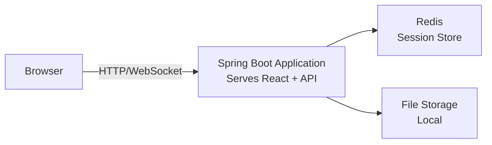
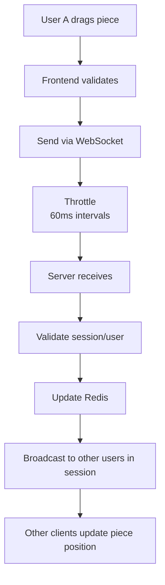
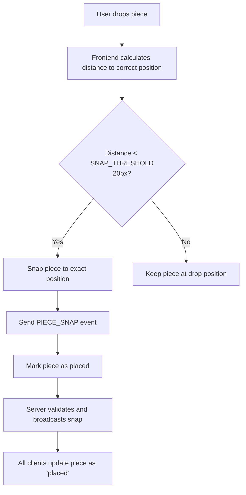
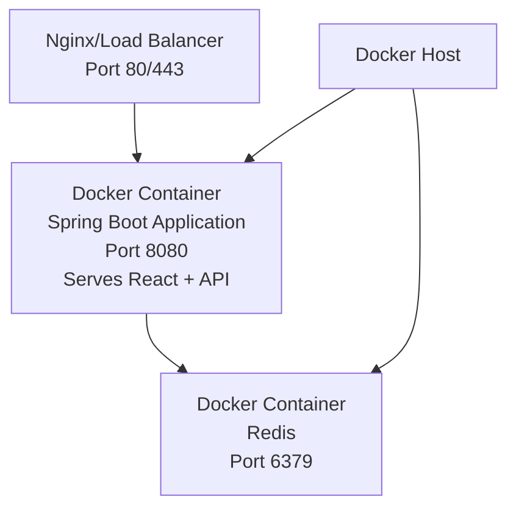

# Software Architecture Plan - Collaborative Jigsaw Puzzle MVP

## 1. System Overview

The Collaborative Jigsaw Puzzle application follows a client-server architecture with real-time WebSocket communication for collaborative features.

### High-Level Architecture



### Key Architectural Decisions

1. **Single Spring Boot application** serving both React frontend and backend API
2. **Stateless REST API** for standard operations (create session, upload image)
3. **Native WebSocket API** (no external libraries) for real-time piece movement synchronization
4. **Redis as primary datastore** (REQUIRED for MVP) - stores all session state, user data, and piece positions
5. **Local file storage** for uploaded images (mounted volume in Docker)
6. **No SQL database** for MVP - Redis handles all data persistence needs

## 2. Backend Architecture (Java Spring Boot)

### 2.1 Project Structure

```
collaborative-puzzle/
├── src/main/java/com/puzzle/
│   ├── PuzzleApplication.java
│   ├── config/
│   │   ├── WebSocketConfig.java
│   │   ├── RedisConfig.java
│   │   └── WebMvcConfig.java  // Configures static resource serving
│   ├── controller/
│   │   ├── PuzzleController.java
│   │   └── ImageUploadController.java
│   ├── websocket/
│   │   └── PuzzleWebSocketHandler.java  // Native WebSocket handler
│   ├── service/
│   │   ├── PuzzleService.java
│   │   ├── ImageProcessingService.java
│   │   └── SessionService.java
│   ├── model/
│   │   ├── PuzzleSession.java
│   │   ├── PuzzlePiece.java
│   │   ├── User.java
│   │   └── PieceMovement.java
│   └── dto/
│       ├── CreateSessionRequest.java
│       ├── JoinSessionRequest.java
│       └── MoveEventDTO.java
├── src/main/resources/
│   ├── static/           // React build output goes here
│   │   ├── index.html
│   │   ├── static/js/
│   │   └── static/css/
│   └── application.yml
├── frontend/             // React source code
│   ├── src/
│   ├── public/
│   └── package.json
├── Dockerfile           // Multi-stage Docker build
├── docker-compose.yml   // Development environment
├── docker-compose.prod.yml  // Production environment
└── pom.xml
```

### 2.2 Core Components

#### REST API Endpoints

```java
POST   /api/sessions/create        // Create new puzzle session
POST   /api/sessions/{id}/join     // Join existing session
POST   /api/sessions/{id}/upload   // Upload image for puzzle
GET    /api/sessions/{id}/state    // Get current puzzle state
GET    /api/images/{filename}      // Serve puzzle images
```

#### WebSocket Endpoint

```
Native WebSocket endpoint:
- ws://localhost:8080/ws/puzzle/{sessionId}

Message types:
- PIECE_MOVE: Piece movement updates
- PIECE_SNAP: Piece snapped to correct position
- USER_JOIN: User joined session
- USER_LEAVE: User left session
```

### 2.3 Key Services

#### PuzzleService
- Creates puzzle sessions with UUID
- Manages puzzle piece generation from images
- Handles piece position validation and snapping logic

#### ImageProcessingService
- Accepts JPG/PNG uploads (max 10MB)
- Slices images into grid pieces (3x3, 5x5, 8x8)
- Generates piece metadata (id, correct position, size)

#### SessionService
- Manages all Redis operations for session state
- Stores puzzle sessions with TTL (time-to-live) for automatic cleanup
- Handles user join/leave events
- Maintains active user lists per session
- Redis data structures used:
  - Hash: Store session metadata
  - Sorted Set: Track active users with timestamps
  - Hash: Store piece positions and states
  - String: Store uploaded image references

### 2.4 Dependencies (pom.xml)

```xml
<dependencies>
    <!-- Spring Boot Starters -->
    <dependency>
        <groupId>org.springframework.boot</groupId>
        <artifactId>spring-boot-starter-web</artifactId>
    </dependency>
    <dependency>
        <groupId>org.springframework.boot</groupId>
        <artifactId>spring-boot-starter-websocket</artifactId>
    </dependency>
    <dependency>
        <groupId>org.springframework.boot</groupId>
        <artifactId>spring-boot-starter-data-redis</artifactId>
    </dependency>
    
    <!-- Image Processing -->
    <dependency>
        <groupId>net.coobird</groupId>
        <artifactId>thumbnailator</artifactId>
        <version>0.4.19</version>
    </dependency>
    
    <!-- Utils -->
    <dependency>
        <groupId>org.projectlombok</groupId>
        <artifactId>lombok</artifactId>
    </dependency>
    <dependency>
        <groupId>com.fasterxml.jackson.core</groupId>
        <artifactId>jackson-databind</artifactId>
    </dependency>
</dependencies>
```

## 3. Frontend Architecture (React)

### 3.1 Project Structure

```
frontend/                    // Located within the Spring Boot project
├── src/
│   ├── App.jsx
│   ├── index.js
│   ├── components/
│   │   ├── LoginScreen.jsx
│   │   ├── UploadScreen.jsx
│   │   ├── PuzzleCanvas.jsx
│   │   ├── PuzzlePiece.jsx
│   │   ├── UserList.jsx
│   │   └── DragLayer.jsx
│   ├── hooks/
│   │   ├── useWebSocket.js     // Native WebSocket implementation
│   │   ├── usePuzzleState.js
│   │   └── useDragAndDrop.js
│   ├── services/
│   │   ├── api.js
│   │   └── websocket.js        // WebSocket service using native API
│   ├── store/
│   │   ├── puzzleSlice.js
│   │   └── store.js
│   └── utils/
│       ├── constants.js
│       └── pieceHelpers.js
├── public/
└── package.json
```

### 3.2 Key Libraries

```json
{
  "dependencies": {
    "react": "^18.2.0",
    "react-dom": "^18.2.0",
    "react-router-dom": "^6.0.0",
    "@reduxjs/toolkit": "^1.9.0",
    "react-redux": "^8.0.0",
    "react-dnd": "^16.0.0",
    "react-dnd-html5-backend": "^16.0.0",
    "axios": "^1.4.0"
  },
  "devDependencies": {
    "@craco/craco": "^7.0.0"
  },
  "scripts": {
    "build": "craco build && cp -r build/* ../src/main/resources/static/"
  }
}
```

Note: Using native WebSocket API instead of external WebSocket libraries.

### 3.3 Core Components

#### PuzzleCanvas
- Renders the main puzzle workspace
- Manages piece positions and drag operations
- Handles piece snapping logic on drop

#### PuzzlePiece
- Individual draggable piece component
- Displays piece image segment
- Shows user cursor when being dragged

#### WebSocket Integration
- Uses native WebSocket API (new WebSocket())
- Establishes connection on session join
- Handles JSON message parsing/serialization
- Implements reconnection logic
- Sends piece movements with throttling

## 4. Data Models

### 4.1 Backend Models

```java
// PuzzleSession.java
public class PuzzleSession {
    private String id;  // UUID
    private String imageUrl;
    private int gridSize;  // 3, 5, or 8
    private List<PuzzlePiece> pieces;
    private List<User> activeUsers;
    private long createdAt;
    private PuzzleState state;  // SETUP, IN_PROGRESS, COMPLETED
}

// PuzzlePiece.java
public class PuzzlePiece {
    private String id;  // piece_0_0 format
    private int correctX, correctY;  // Target position
    private double currentX, currentY;  // Current position
    private int width, height;
    private boolean isPlaced;  // Snapped to correct position
    private String heldByUser;  // Username or null
}

// User.java
public class User {
    private String name;
    private String sessionId;
    private String color;  // For cursor display
    private long joinedAt;
}
```

### 4.2 WebSocket Message Formats

```json
// Piece Movement Event
{
  "type": "PIECE_MOVE",
  "pieceId": "piece_2_3",
  "x": 245.5,
  "y": 367.2,
  "userId": "John",
  "timestamp": 1672531200000
}

// Piece Snap Event
{
  "type": "PIECE_SNAP",
  "pieceId": "piece_2_3",
  "correctX": 200,
  "correctY": 300,
  "userId": "John"
}

// User Join/Leave Event
{
  "type": "USER_JOIN",
  "user": {
    "name": "John",
    "color": "#FF5733",
    "joinedAt": 1672531200000
  }
}
```

## 5. Real-time Synchronization Flow

### 5.1 Piece Movement Synchronization



### 5.2 Snap Detection



## 6. Security Considerations

### 6.1 MVP Security Measures
- Input validation for usernames (alphanumeric, max 20 chars)
- File upload validation (type, size)
- Rate limiting on API endpoints
- WebSocket message validation
- UUID session IDs to prevent guessing

### 6.2 CORS Configuration
```java
@Configuration
public class CorsConfig {
    @Bean
    public WebMvcConfigurer corsConfigurer() {
        return new WebMvcConfigurer() {
            @Override
            public void addCorsMappings(CorsRegistry registry) {
                registry.addMapping("/**")
                    .allowedOrigins("http://localhost:3000")
                    .allowedMethods("GET", "POST", "PUT", "DELETE")
                    .allowCredentials(true);
            }
        };
    }
}
```

## 7. Deployment Architecture

### 7.1 Local Development
```bash
# Option 1: Using Docker Compose (Recommended)
docker-compose up

# Option 2: Manual setup
# Start Redis first (REQUIRED)
docker run -p 6379:6379 redis:7-alpine

# Then start backend
mvn spring-boot:run

# And frontend development server
cd frontend && npm start
```

### 7.2 MVP Production Deployment



### 7.3 Environment Configuration

```yaml
# application.yml
spring:
  redis:
    host: ${REDIS_HOST:localhost}
    port: ${REDIS_PORT:6379}
  servlet:
    multipart:
      max-file-size: 10MB
      max-request-size: 10MB
  
puzzle:
  session-timeout: 3600  # 1 hour
  max-users-per-session: 10
  allowed-image-types: jpg,jpeg,png
```

## 8. Performance Optimizations

### 8.1 Frontend
- Throttle WebSocket messages (60ms intervals)
- Use React.memo for PuzzlePiece components
- Implement virtual scrolling for large puzzles
- Lazy load puzzle pieces as they come into view

### 8.2 Backend
- Redis connection pooling
- Image caching after processing
- WebSocket message batching
- Async image processing

## 9. Monitoring and Logging

### 9.1 Key Metrics
- Active sessions count
- Users per session
- WebSocket message rate
- Image upload success/failure rate
- Average session duration

### 9.2 Logging Strategy
```java
// Structured logging with context
log.info("Puzzle session created", 
    "sessionId", sessionId,
    "gridSize", gridSize,
    "imageSize", imageFile.getSize());
```

## 10. Testing Strategy

### 10.1 Backend Testing
- Unit tests for services
- Integration tests for WebSocket flows
- Load testing for concurrent users

### 10.2 Frontend Testing
- Component tests with React Testing Library
- E2E tests for critical user flows
- WebSocket mock testing

## 11. Spring Boot Static Resource Configuration

```java
@Configuration
public class WebMvcConfig implements WebMvcConfigurer {
    @Override
    public void addResourceHandlers(ResourceHandlerRegistry registry) {
        // Serve React app from static resources
        registry.addResourceHandler("/**")
                .addResourceLocations("classpath:/static/")
                .resourceChain(true)
                .addResolver(new PathResourceResolver() {
                    @Override
                    protected Resource getResource(String resourcePath, Resource location) throws IOException {
                        Resource requestedResource = location.createRelative(resourcePath);
                        // Fallback to index.html for React Router
                        return requestedResource.exists() && requestedResource.isReadable() 
                            ? requestedResource 
                            : new ClassPathResource("/static/index.html");
                    }
                });
    }
}
```

## 12. Native WebSocket Implementation Example

```javascript
// useWebSocket.js
export const useWebSocket = (sessionId) => {
    const [ws, setWs] = useState(null);
    
    useEffect(() => {
        const websocket = new WebSocket(`ws://localhost:8080/ws/puzzle/${sessionId}`);
        
        websocket.onopen = () => {
            console.log('WebSocket connected');
        };
        
        websocket.onmessage = (event) => {
            const message = JSON.parse(event.data);
            // Handle different message types
        };
        
        websocket.onerror = (error) => {
            console.error('WebSocket error:', error);
        };
        
        setWs(websocket);
        
        return () => {
            websocket.close();
        };
    }, [sessionId]);
    
    const sendMessage = (message) => {
        if (ws && ws.readyState === WebSocket.OPEN) {
            ws.send(JSON.stringify(message));
        }
    };
    
    return { sendMessage };
};
```

## 13. Build and Deployment Process

### Development Workflow
1. Frontend development: `cd frontend && npm start` (runs on port 3000 with proxy to 8080)
2. Backend development: `mvn spring-boot:run` (runs on port 8080)
3. Docker development: `docker-compose up` (runs entire stack)

### Production Build
```bash
# Build React app and copy to Spring Boot static resources
cd frontend
npm run build
cp -r build/* ../src/main/resources/static/

# Build Spring Boot JAR
cd ..
mvn clean package

# Run the application
java -jar target/collaborative-puzzle-1.0.0.jar
```

### Docker Containerization

#### Dockerfile (Multi-stage build)
```dockerfile
# Stage 1: Build React frontend
FROM node:18-alpine AS frontend-build
WORKDIR /app/frontend
COPY frontend/package*.json ./
RUN npm ci
COPY frontend/ ./
RUN npm run build

# Stage 2: Build Spring Boot application
FROM maven:3.8-openjdk-11 AS backend-build
WORKDIR /app
COPY pom.xml ./
COPY src ./src
# Copy React build from previous stage
COPY --from=frontend-build /app/frontend/build ./src/main/resources/static
RUN mvn clean package -DskipTests

# Stage 3: Runtime image
FROM openjdk:11-jre-slim
WORKDIR /app
COPY --from=backend-build /app/target/collaborative-puzzle-*.jar app.jar
EXPOSE 8080
ENTRYPOINT ["java", "-jar", "app.jar"]
```

#### docker-compose.yml (Development)
```yaml
version: '3.8'
services:
  app:
    build: .
    ports:
      - "8080:8080"
    environment:
      - SPRING_PROFILES_ACTIVE=docker
      - REDIS_HOST=redis
      - REDIS_PORT=6379
    depends_on:
      - redis
    volumes:
      - ./uploads:/app/uploads
    networks:
      - puzzle-network
  
  redis:
    image: redis:7-alpine
    ports:
      - "6379:6379"
    volumes:
      - redis-data:/data
    command: redis-server --appendonly yes --maxmemory 256mb --maxmemory-policy allkeys-lru
    networks:
      - puzzle-network
    healthcheck:
      test: ["CMD", "redis-cli", "ping"]
      interval: 5s
      timeout: 3s
      retries: 5

volumes:
  redis-data:

networks:
  puzzle-network:
    driver: bridge
```

#### docker-compose.prod.yml (Production)
```yaml
version: '3.8'
services:
  app:
    image: collaborative-puzzle:latest
    ports:
      - "80:8080"
    environment:
      - SPRING_PROFILES_ACTIVE=production
      - REDIS_HOST=redis
      - REDIS_PORT=6379
      - JAVA_OPTS=-Xmx512m -Xms256m
    depends_on:
      redis:
        condition: service_healthy
    restart: unless-stopped
    volumes:
      - ./uploads:/app/uploads
    networks:
      - puzzle-network
  
  redis:
    image: redis:7-alpine
    volumes:
      - redis-data:/data
    restart: unless-stopped
    command: redis-server --appendonly yes --maxmemory 512mb --maxmemory-policy allkeys-lru
    networks:
      - puzzle-network
    healthcheck:
      test: ["CMD", "redis-cli", "ping"]
      interval: 5s
      timeout: 3s
      retries: 5

volumes:
  redis-data:
    driver: local

networks:
  puzzle-network:
    driver: bridge
```

### Build and Run Commands
```bash
# Build Docker image
docker build -t collaborative-puzzle:latest .

# Run with docker-compose (development)
docker-compose up

# Run with docker-compose (production)
docker-compose -f docker-compose.prod.yml up -d

# View logs
docker-compose logs -f app

# Stop containers
docker-compose down
```

## 14. Future Architecture Considerations

As the application grows beyond MVP, consider:
- Horizontal scaling with multiple backend instances
- Message queue (RabbitMQ/Kafka) for event processing
- CDN for static asset delivery
- Database persistence for session history
- Microservices separation (image processing, game logic)
- WebRTC for peer-to-peer optimization